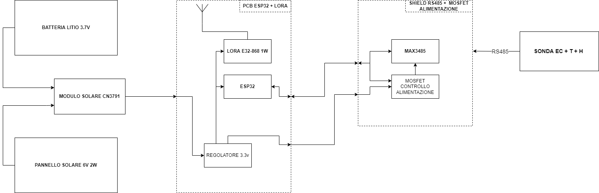

# SoilTrack

Costruzione di un sistema per gestire una rete di sensori per misurare svariati parametri del suolo come umidità temperatura conducibilità elettrica ecc...

## Visualizzazione e accesso ai dati
Tutte le misurazioni effettuate dai sensori sono caricate e visualizzabili sul sito:
www.iotprojects.it

Accedendo con le credenziali: 
 - User: demo2
 - Password: soilDemo2

## Nodo

